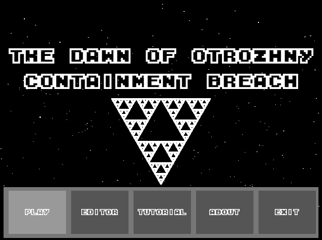
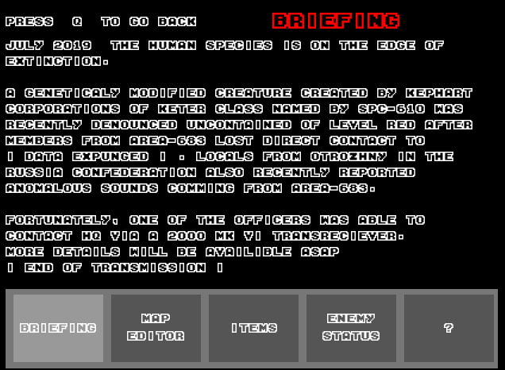
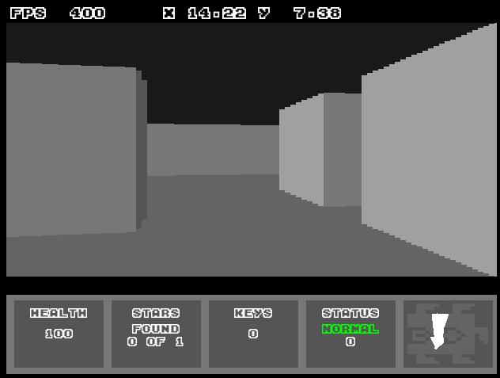
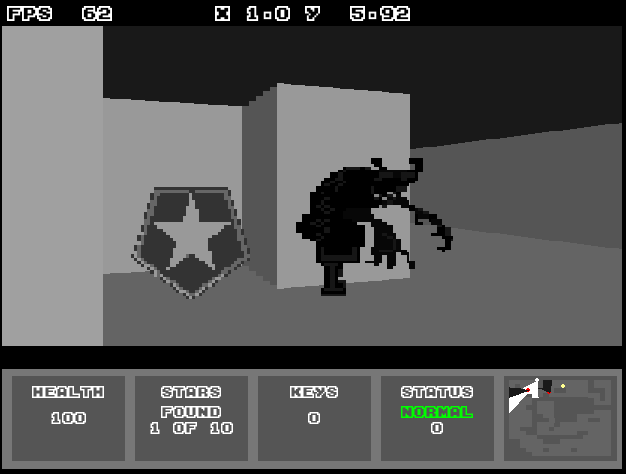

# The dawn of Otrozhny

A game made in python for my high school culminating activity in 2018.

I made this game over the course of about 2 months, and I wasn't very knowledgeable about python at the time, so the code is pretty messy.

## Features

- Pseudo 3D ray-casting engine (similar to Wolfenstein 3D)
- Level editor
- Node based enemy AI
- Stealth mechanics
- Backstory
- Sound effects

## Requirements

- Python 3.6
- pygame
- numpy

## How to run

```cmd
pip install numpy pygame
cd The dawn of Otrozhny
python main.py
```

Main Menu



Tutorial Tabs



Ray-casting engine



Gameplay


